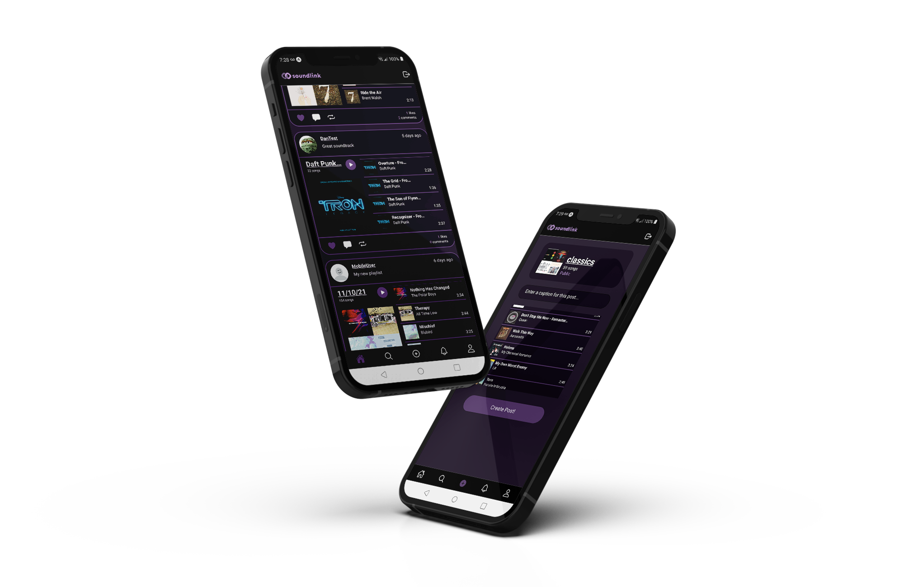

### COP 4331 Large Project

discover new sounds
=============
Soundlink is a social media platform that emphasizes playlist sharing via its mobile app.

Users have the ability to post playlists through their Spotify account.

Both followers and non-followers can interact with your content via likes, comments, reposts, and messages.

